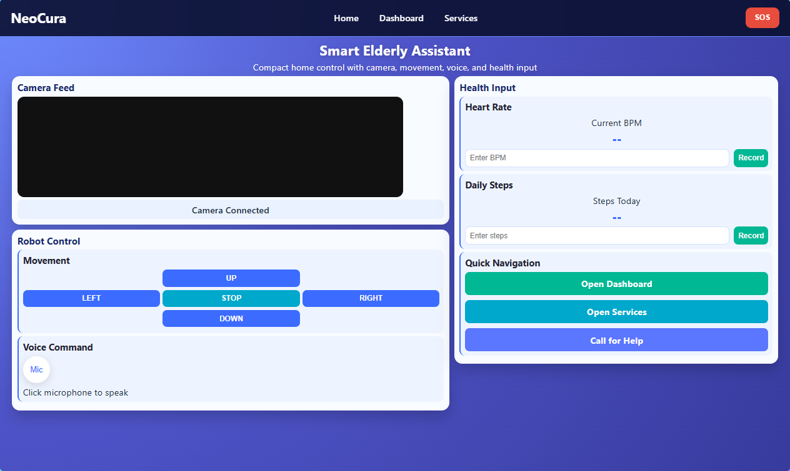
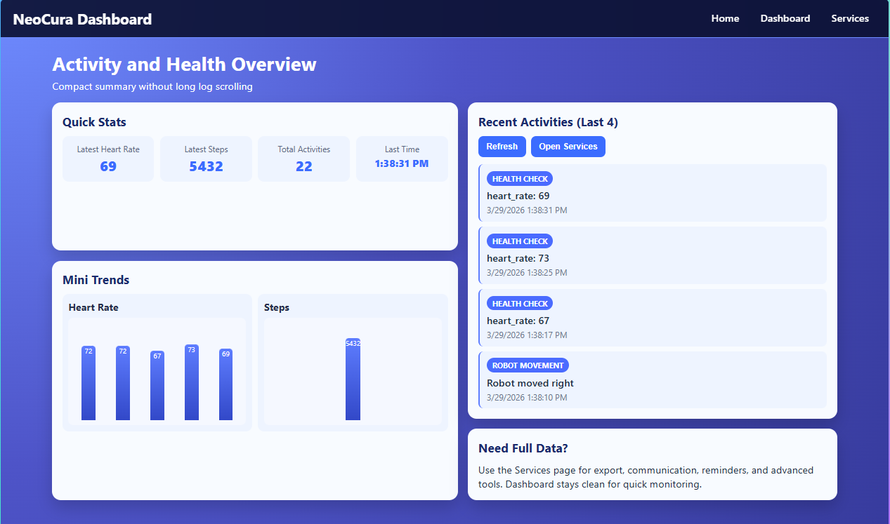
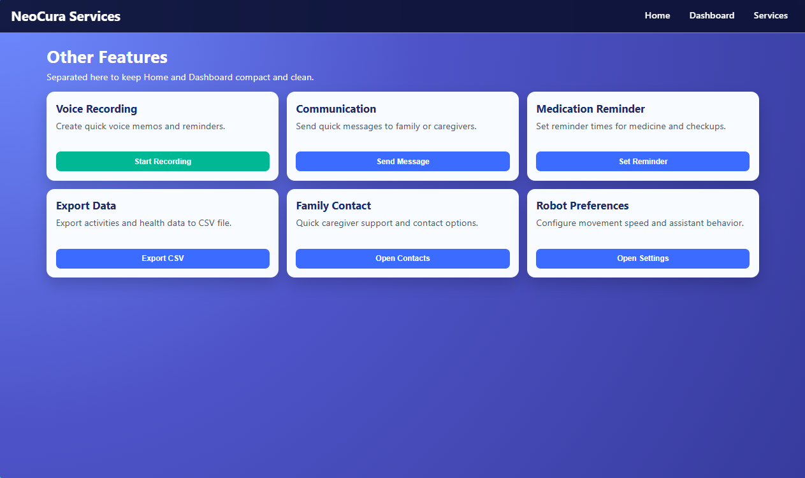
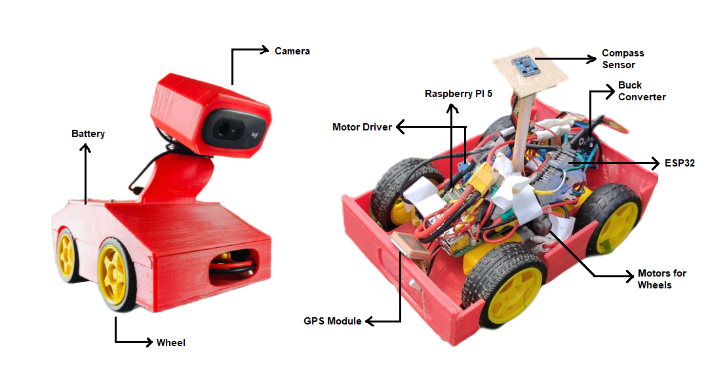

# NeoCura — Personal Assistant Robot for Elderly People

NeoCura is a **personal-assistant robot project** focused on helping elderly people through a simple web interface and a Flask-based backend.  
It includes:
- **Robot movement control** (direction commands)
- **Live camera/video feed streaming**
- **Health monitoring endpoints** (heart rate, steps)
- **Activity logging + emergency action logging**
- A basic **web dashboard / services UI**

> Repo name note: the repository name contains `Pepole` (typo). This README keeps the original repo naming to match your project.

---

## Preview / Screenshots

### Home


### Dashboard


### Services


### Robot / UI Shots



---

## Project Structure (high level)

- `Camera.py` — Main **Flask server** providing:
  - UI routes (`/`, `/dashboard`, `/services`)
  - robot control API (`/move`)
  - health APIs (`/health/...`)
  - activities (`/activities`)
  - emergency (`/emergency`)
  - camera streaming (`/video_feed`)
- `templates/` — Flask templates (`index.html`, `dashboard.html`, `services.html`)
- `Web View/` — A separate PHP-based web UI (includes pages like `Camera.php`, `Dashboard.php`, etc.)
- `SS/` — Screenshots used in this README
- `Database/youngboys.sql` — SQL dump (database schema/data)

---

## Features

### 1) Robot movement control
Send a direction to the robot:
- `POST /move`
- JSON body: `{ "direction": "up" | "down" | "left" | "right" }`

### 2) Live camera feed
- `GET /video_feed`  
Provides an MJPEG stream that can be placed in an `` tag.

### 3) Health monitoring + activity logging
- `POST /health/heart_rate` → logs heart rate (stored in `health_data.json`)
- `POST /health/steps` → logs step count
- `GET /health/data` → returns stored health data
- `GET /activities` → returns latest activities (last 50)

### 4) Emergency endpoint
- `POST /emergency` with `{ "action": "SOS" }` (or any action text)

---

## Getting Started (Flask backend)

### Requirements
You’ll need Python 3 and these packages:
- `flask`
- `flask-cors`
- `opencv-python`

Install (example):
```bash
pip install flask flask-cors opencv-python
```

### Run the server
```bash
python Camera.py
```

By default it runs on:
- `http://0.0.0.0:5000`

Open in browser (from same machine):
- `http://127.0.0.1:5000/`

---

## API Quick Test Examples

### Move robot
```bash
curl -X POST http://127.0.0.1:5000/move \
  -H "Content-Type: application/json" \
  -d "{\"direction\":\"up\"}"
```

### Add heart rate
```bash
curl -X POST http://127.0.0.1:5000/health/heart_rate \
  -H "Content-Type: application/json" \
  -d "{\"heart_rate\":72}"
```

### Add steps
```bash
curl -X POST http://127.0.0.1:5000/health/steps \
  -H "Content-Type: application/json" \
  -d "{\"steps\":1200}"
```

### Read stored health data
```bash
curl http://127.0.0.1:5000/health/data
```

---

## Notes / Configuration

### Camera source
In `Camera.py`:
```python
camera_feed_url = 0
```
- `0` uses the default webcam.
- Replace with an IP camera/stream URL if needed.

### Data files
The Flask backend writes:
- `health_data.json`
- `activities.json`

---

## Web View (PHP)
The `Web View/` folder contains a PHP frontend (example: camera page uses a URL like `http://<raspberry-pi-ip>:5000/video_feed` and sends commands to `http://<raspberry-pi-ip>:5000/move`).  
If you use it, make sure to replace the hardcoded IP address with your own device IP.

---

## License
This project is licensed under the MIT License - see the LICENSE file for details.
